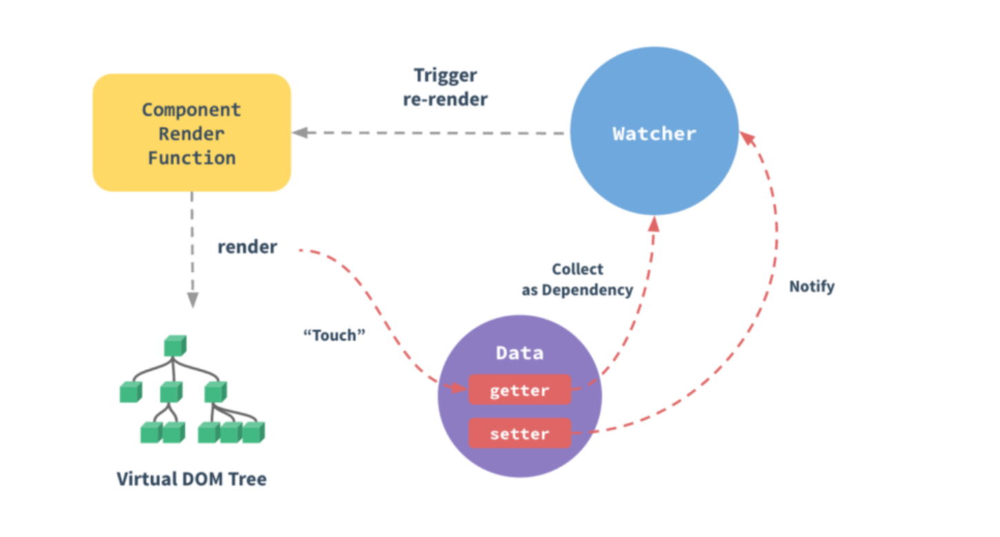
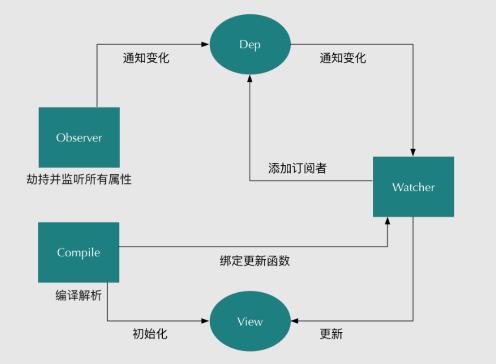

# Vue2
::: tip 一、Vue2的基本原理

当一个Vue实例创建时，Vue会遍历data中的属性，用 Object.defineProperty（vue3.0使用proxy ）将它们转为 getter/setter，并且在内部追踪相关依赖，在属性被访问和修改时通知变化。 每个组件实例都有相应的 watcher 程序实例，它会在组件渲染的过程中把属性记录为依赖，之后当依赖项的setter被调用时，会通知watcher重新计算，从而致使它关联的组件得以更新。
:::



::: tip 二、双向数据绑定的原理
Vue.js 是采用数据劫持结合发布者-订阅者模式的方式，通过Object.defineProperty()来劫持各个属性的setter，getter，在数据变动时发布消息给订阅者，触发相应的监听回调。主要分为以下几个步骤：
:::

 1. 需要observe的数据对象进行递归遍历，包括子属性对象的属性，都加上setter和getter这样的话，给这个对象的某个值赋值，就会触发setter，那么就能监听到了数据变化
 2. compile解析模板指令，将模板中的变量替换成数据，然后初始化渲染页面视图，并将每个指令对应的节点绑定更新函数，添加监听数据的订阅者，一旦数据有变动，收到通知，更新视图
 3. Watcher订阅者是Observer和Compile之间通信的桥梁，主要做的事情是: ①在自身实例化时往属性订阅器(dep)里面添加自己 ②自身必须有一个update()方法 ③待属性变动dep.notice()通知时，能调用自身的update()方法，并触发Compile中绑定的回调，则功成身退。
 4. MVVM作为数据绑定的入口，整合Observer、Compile和Watcher三者，通过Observer来监听自己的model数据变化，通过Compile来解析编译模板指令，最终利用Watcher搭起Observer和Compile之间的通信桥梁，达到数据变化 -> 视图更新；视图交互变化(input) -> 数据model变更的双向绑定效果。


::: tip 三、使用 Object.defineProperty() 来进行数据劫持有什么缺点？

:::
在对一些属性进行操作时，使用这种方法无法拦截，比如通过下标方式修改数组数据或者给对象新增属性，这都不能触发组件的重新渲染，因为 Object.defineProperty 不能拦截到这些操作。更精确的来说，对于数组而言，大部分操作都是拦截不到的，只是 Vue 内部通过重写函数的方式解决了这个问题。

在Vue3.0 中已经不使用这种方式了，而是通过使用 Proxy 对对象进行代理，从而实现数据劫持。使用Proxy 的好处是它可以完美的监听到任何方式的数据改变，唯一的缺点是兼容性的问题，因为 Proxy 是 ES6 的语法。

:::tip 四、Computed 和 Watch 的区别
:::
对于Computed：
+ 它支持缓存，只有依赖的数据发生了变化，才会重新计算
+ 不支持异步，当Computed中有异步操作时，无法监听数据的变化
+ computed的值会默认走缓存，计算属性是基于它们的响应式依赖进行缓存的，也就是基于data声明过，或者父组件传递过来的props中的数据进行计算的。
+ 如果一个属性是由其他属性计算而来的，这个属性依赖其他的属性，一般会使用computed
+ 如果computed属性的属性值是函数，那么默认使用get方法，函数的返回值就是属性的属性值；在computed中，属性有一个get方法和一个set方法，当数据发生变化时，会调用set方法。
  
对于Watch：
+ 它不支持缓存，数据变化时，它就会触发相应的操作
+ 支持异步监听 
+ 监听的函数接收两个参数，第一个参数是最新的值，第二个是变化之前的值
+ 当一个属性发生变化时，就需要执行相应的操作
+ 监听数据必须是data中声明的或者父组件传递过来的props中的数据，当发生变化时，会触发其他操作，函数有两个的参数：
+ immediate：组件加载立即触发回调函数
+ deep：深度监听，发现数据内部的变化，在复杂数据类型中使用，例如数组中的对象发生变化。
+ 需要注意的是，deep无法监听到数组和对象内部的变化。
+ 当想要执行异步或者昂贵的操作以响应不断的变化时，就需要使用watch。

总结：
+ computed 计算属性 : 依赖其它属性值，并且 computed 的值有缓存，只有它依赖的属性值发生改变，下一次获取 computed 的值时才会重新计算 computed 的值。
+ watch 侦听器 : 更多的是观察的作用，无缓存性，类似于某些数据的监听回调，每当监听的数据变化时都会执行回调进行后续操作。

运用场景：
+ 当需要进行数值计算,并且依赖于其它数据时，应该使用 computed，因为可以利用 computed 的缓存特性，避免每次获取值时都要重新计算。
+ 当需要在数据变化时执行异步或开销较大的操作时，应该使用 watch，使用 watch 选项允许执行异步操作 ( 访问一个 API )，限制执行该操作的频率，并在得到最终结果前，设置中间状态。这些都是计算属性无法做到的。
  

:::tip 五、Computed 和 Methods 的区别
:::
+ computed: 计算属性是基于它们的依赖进行缓存的，只有在它的相关依赖发生改变时才会重新求值；
+ method 调用总会执行该函数。

:::tip 六、slot是什么？有什么作用？原理是什么？
:::
slot又名插槽，是Vue的内容分发机制，组件内部的模板引擎使用slot元素作为承载分发内容的出口。插槽slot是子组件的一个模板标签元素，而这一个标签元素是否显示，以及怎么显示是由父组件决定的。slot又分三类，默认插槽，具名插槽和作用域插槽。

+ 默认插槽：又名匿名查抄，当slot没有指定name属性值的时候一个默认显示插槽，一个组件内只有有一个匿名插槽。
+ 具名插槽：带有具体名字的插槽，也就是带有name属性的slot，一个组件可以出现多个具名插槽。
+ 作用域插槽：默认插槽、具名插槽的一个变体，可以是匿名插槽，也可以是具名插槽，该插槽的不同点是在子组件渲染作用域插槽时，可以将子组件内部的数据传递给父组件，让父组件根据子组件的传递过来的数据决定如何渲染该插槽。

实现原理：
+ 当子组件vm实例化时，获取到父组件传入的slot标签的内容，存放在vm.$slot中，默认插槽为vm.$slot.default，具名插槽为 vm.$slot.name ，name 为插槽名，当组件执行渲染函数时候，遇到slot标签，使用$slot中的内容进行替换，此时可以为插槽传递数据，若存在数据，则可称该插槽为作用域插槽。


:::tip 七、缓存组件 
:::

在Vue中，还可以是用keep-alive来缓存页面，当组件在keep-alive内被切换时组件的activated、deactivated这两个生命周期钩子函数会被执行

被包裹在keep-alive中的组件的状态将会被保留：
```html
<keep-alive>
    <router-view v-if="$route.meta.keepAlive"></router-view>
</kepp-alive>
```
router.js
```js
{
  path: '/',
  name: 'xxx',
  component: ()=>import('../src/views/xxx.vue'),
  meta:{
    keepAlive: true // 需要被缓存
  }
},
```
:::tip 八、常见的事件修饰符及其作用 
:::
+ .stop：等同于 JavaScript 中的 event.stopPropagation() ，防止事件冒泡；
+ .prevent ：等同于 JavaScript 中的 event.preventDefault() ，防止执行预设的行为（如果事件可取消，则取消该事件，而不停止事件的进一步传播）；
+ .capture ：与事件冒泡的方向相反，事件捕获由外到内；
+ .self ：只会触发自己范围内的事件，不包含子元素；
+ .once ：只会触发一次。


:::tip 九、v-if、v-show、v-html 的原理 
:::
+ v-if会调用addIfCondition方法，生成vnode的时候会忽略对应节点，render的时候就不会渲染；
+ v-show会生成vnode，render的时候也会渲染成真实节点，只是在render过程中会在节点的属性中修改show属性值，也就是常说的display；
+ v-html会先移除节点下的所有节点，调用html方法，通过addProp添加innerHTML属性，归根结底还是设置innerHTML为v-html的值。


:::tip 十、v-if和v-show的区别 
:::
+ 手段：v-if是动态的向DOM树内添加或者删除DOM元素；v-show是通过设置DOM元素的display样式属性控制显隐；
+ 编译过程：v-if切换有一个局部编译/卸载的过程，切换过程中合适地销毁和重建内部的事件监听和子组件；v-show只是简单的基于css切换；
+ 编译条件：v-if是惰性的，如果初始条件为假，则什么也不做；只有在条件第一次变为真时才开始局部编译; v-show是在任何条件下，无论首次条件是否为真，都被编译，然后被缓存，而且DOM元素保留；
+ 性能消耗：v-if有更高的切换消耗；v-show有更高的初始渲染消耗；
+ 使用场景：v-if适合运营条件不大可能改变；v-show适合频繁切换。


:::tip 十一、v-model 是如何实现的，语法糖实际是什么？
:::
1.作用在表单元素上
- 动态绑定了 input 的 value 指向了 messgae 变量，并且在触发 input 事件的时候去动态把 message设置为目标值：
```html
<input v-model="sth" />
//  等同于
<input 
    v-bind:value="message" 
    v-on:input="message=$event.target.value"
>
<!-- $event 指代当前触发的事件对象; -->
<!-- $event.target 指代当前触发的事件对象的dom; -->
<!-- $event.target.value 就是当前dom的value值; -->
<!-- 在@input方法中，value => sth; -->
<!-- 在:value中,sth => value; -->
```

2.作用在组件上
- 在自定义组件中，v-model 默认会利用名为 value 的 prop和名为 input 的事件
本质是一个父子组件通信的语法糖，通过prop和$.emit实现。因此父组件 v-model 语法糖本质上可以修改为：
```html
<child :value="message"  @input="function(e){message = e}"></child>
```

- 在组件的实现中，可以通过 v-model属性来配置子组件接收的prop名称，以及派发的事件名称。
```js
// 父组件
<aa-input v-model="aa"></aa-input>
// 等价于
<aa-input v-bind:value="aa" v-on:input="aa=$event.target.value"></aa-input>

// 子组件：
<input v-bind:value="aa" v-on:input="onmessage"></aa-input>

props:{value:aa,}
methods:{
    onmessage(e){
        $emit('input',e.target.value)
    }
}
```


:::tip 十二、data为什么是一个函数而不是对象？
:::
JavaScript中的对象是引用类型的数据，当多个实例引用同一个对象时，只要一个实例对这个对象进行操作，其他实例中的数据也会发生变化。

而在Vue中，更多的是想要复用组件，那就需要每个组件都有自己的数据，这样组件之间才不会相互干扰。

所以组件的数据不能写成对象的形式，而是要写成函数的形式。数据以函数返回值的形式定义，这样当每次复用组件的时候，就会返回一个新的data，也就是说每个组件都有自己的私有数据空间，它们各自维护自己的数据，不会干扰其他组件的正常运行。


:::tip 十三、$nextTick 原理及作用
:::
Vue 的 nextTick 其本质是对 JavaScript 执行原理 EventLoop 的一种应用。
nextTick 的核心是利用了如 Promise 、MutationObserver、setImmediate、setTimeout的原生 JavaScript 方法来模拟对应的微/宏任务的实现，本质是为了利用 JavaScript 的这些异步回调任务队列来实现 Vue 框架中自己的异步回调队列。

nextTick 不仅是 Vue 内部的异步队列的调用方法，同时也允许开发者在实际项目中使用这个方法来满足实际应用中对 DOM 更新数据时机的后续逻辑处理

nextTick 是典型的将底层 JavaScript 执行原理应用到具体案例中的示例，引入异步更新队列机制的原因∶

+ 如果是同步更新，则多次对一个或多个属性赋值，会频繁触发 UI/DOM 的渲染，可以减少一些无用渲染
+ 同时由于 VirtualDOM 的引入，每一次状态发生变化后，状态变化的信号会发送给组件，组件内部使用 VirtualDOM 进行计算得出需要更新的具体的 DOM 节点，然后对 DOM 进行更新操作，每次更新状态后的渲染过程需要更多的计算，而这种无用功也将浪费更多的性能，所以异步渲染变得更加至关重要

Vue采用了数据驱动视图的思想，但是在一些情况下，仍然需要操作DOM。有时候，可能遇到这样的情况，DOM1的数据发生了变化，而DOM2需要从DOM1中获取数据，那这时就会发现DOM2的视图并没有更新，这时就需要用到了nextTick了。

由于Vue的DOM操作是异步的，所以，在上面的情况中，就要将DOM2获取数据的操作写在$nextTick中。

```js
this.$nextTick(() => {
    // 获取数据的操作...
})
```

所以，在以下情况下，会用到nextTick：
+ 在数据变化后执行的某个操作，而这个操作需要使用随数据变化而变化的DOM结构的时候，这个操作就需要方法在nextTick()的回调函数中。
+ 在vue生命周期中，如果在created()钩子进行DOM操作，也一定要放在nextTick()的回调函数中。
  
因为在created()钩子函数中，页面的DOM还未渲染，这时候也没办法操作DOM，所以，此时如果想要操作DOM，必须将操作的代码放在nextTick()的回调函数中。


:::tip 十四、Vue 中给 data 中的对象属性添加一个新的属性时会发生什么？如何解决？
:::

```vue
<template> 
   <div>
      <ul>
         <li v-for="value in obj" :key="value"> {{value}} </li> 
      </ul> 
      <button @click="addObjB">添加 obj.b</button> 
   </div>
</template>

<script>
    export default { 
       data () { 
          return { 
              obj: { 
                  a: 'obj.a' 
              } 
          } 
       },
       methods: { 
          addObjB () { 
              this.obj.b = 'obj.b' 
              console.log(this.obj) 
          } 
      }
   }
</script>
```
点击 button 会发现，obj.b 已经成功添加，但是视图并未刷新。这是因为在Vue实例创建时，obj.b并未声明，因此就没有被Vue转换为响应式的属性，自然就不会触发视图的更新，这时就需要使用Vue的全局 api $set()：
```js
addObjB () (
   this.$set(this.obj, 'b', 'obj.b')
   console.log(this.obj)
}
```
$set相当于给数据手动添加响应式，视图会实时更新


:::tip 十五、Vue中封装的数组方法有哪些，其如何实现页面更新
:::
在Vue中，对响应式处理利用的是Object.defineProperty对数据进行拦截，而这个方法并不能监听到数组内部变化，数组长度变化，数组的截取变化等，所以需要对这些操作进行hack，让Vue能监听到其中的变化。

```js
// 缓存数组原型
const arrayProto = Array.prototype;
// 实现 arrayMethods.__proto__ === Array.prototype
export const arrayMethods = Object.create(arrayProto);
// 需要进行功能拓展的方法
const methodsToPatch = [
  "push",
  "pop",
  "shift",
  "unshift",
  "splice",
  "sort",
  "reverse"
];

/**
 * Intercept mutating methods and emit events
 */
methodsToPatch.forEach(function(method) {
  // 缓存原生数组方法
  const original = arrayProto[method];
  def(arrayMethods, method, function mutator(...args) {
    // 执行并缓存原生数组功能
    const result = original.apply(this, args);
    // 响应式处理
    const ob = this.__ob__;
    let inserted;
    switch (method) {
    // push、unshift会新增索引，所以要手动observer
      case "push":
      case "unshift":
        inserted = args;
        break;
      // splice方法，如果传入了第三个参数，也会有索引加入，也要手动observer。
      case "splice":
        inserted = args.slice(2);
        break;
    }
    // 
    if (inserted) ob.observeArray(inserted);// 获取插入的值，并设置响应式监听
    // notify change
    ob.dep.notify();// 通知依赖更新
    // 返回原生数组方法的执行结果
    return result;
  });
});
```

简单来说就是，重写了数组中的那些原生方法，首先获取到这个数组的__ob__，也就是它的Observer对象，如果有新的值，就调用observeArray继续对新的值观察变化（也就是通过target__proto__ == arrayMethods来改变了数组实例的型），然后手动调用notify，通知渲染watcher，执行update


