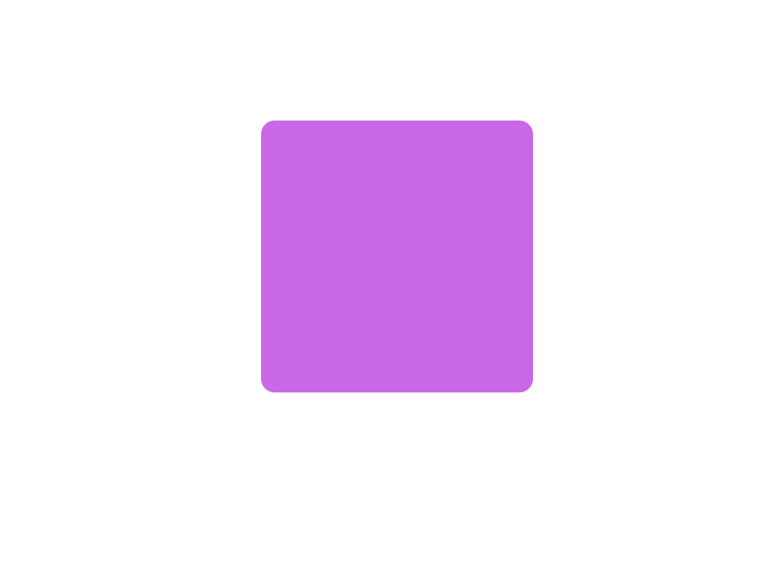

# CSS 关键帧动画：@keyframes、animation

```html
<div class="box"></div>
```
```css
.box {
    width: 200px;
    height: 200px;
    background-color: #ca68e8;
    border-radius: 10px;
    margin:100px auto;
}
```
:::tip @keyframes
定义关键帧
:::
```css
/* 定义关键帧 */
@keyframes change {
    0%{
        width: 200px;
        height: 200px;
        background-color: #ca68e8;
        transform: rotate(0deg);
    }
    100%{
        width: 400px;
        height: 400px;
        background-color: #61087c;
        transform: rotate(360deg);
    }
}
```



:::tip animation
使用关键帧动画
:::

```css
.box {
    width: 200px;
    height: 200px;
    background-color: #ca68e8;
    border-radius: 10px;
    margin:100px auto;
    /* animation: 动画名称 时间 无限 匀速 交替 */
    animation: change 1s infinite linear alternate;
}
```
最终效果：


