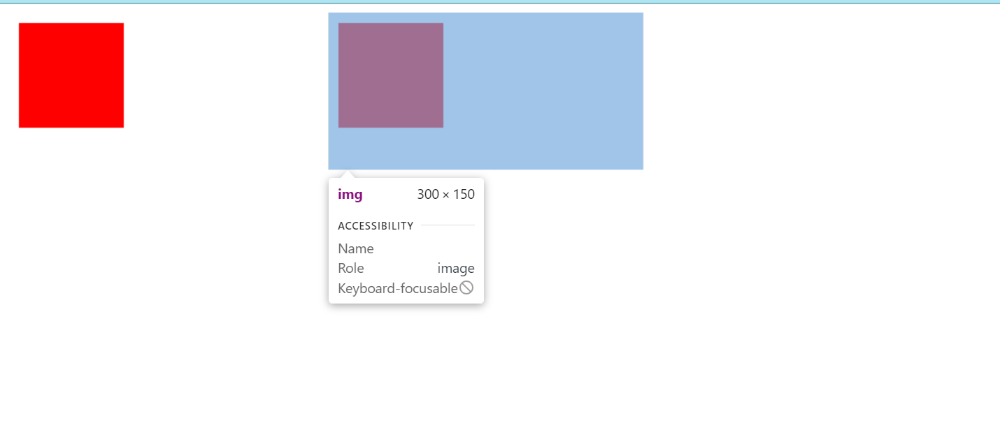

# Canvas


:::tip 1. canvas导出图片 :musical_note:
:::
要在 Canvas 中导出图片，你可以使用 toDataURL() 方法将 Canvas 的内容转换为 base64 编码的图片格式。以下是一个简单的示例代码：

```html
<canvas id="myCanvas"></canvas>
```
```js
// 获取 Canvas 元素
var canvas = document.getElementById('myCanvas');
// 获取 2D 上下文
var ctx = canvas.getContext('2d');

// 在 Canvas 上绘制内容
ctx.fillStyle = 'red';
ctx.fillRect(10, 10, 100, 100);

// 导出 Canvas 内容为图片
var imageData = canvas.toDataURL('image/png');

// 创建一个新的图片元素
var img = new Image();
img.src = imageData;

// 添加到页面中显示
document.body.appendChild(img);
```

在这个示例中，我们首先获取了 Canvas 元素和 2D 上下文，然后在 Canvas 上绘制了一个红色矩形。接着，通过调用 toDataURL() 方法将 Canvas 内容转换为 base64 编码的 PNG 图片格式，并将其赋值给一个新创建的图片元素的 src 属性，最后将该图片元素添加到页面中显示。

你可以根据实际需求对导出的图片进行处理或保存。

